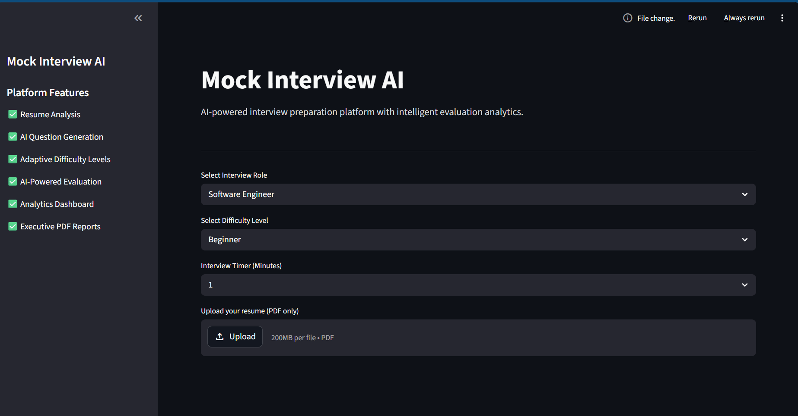
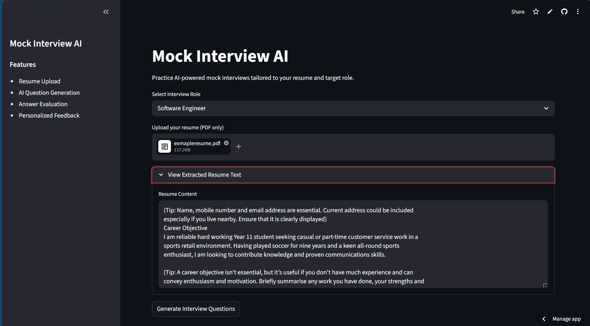
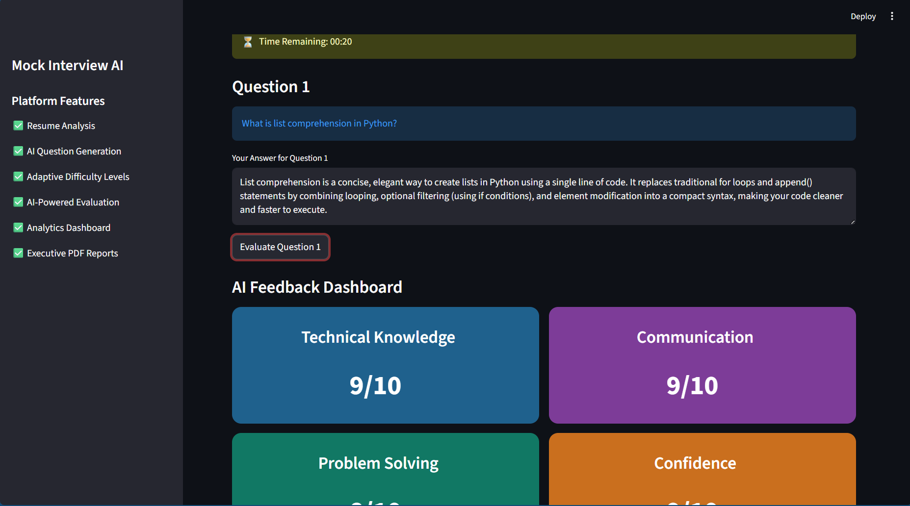
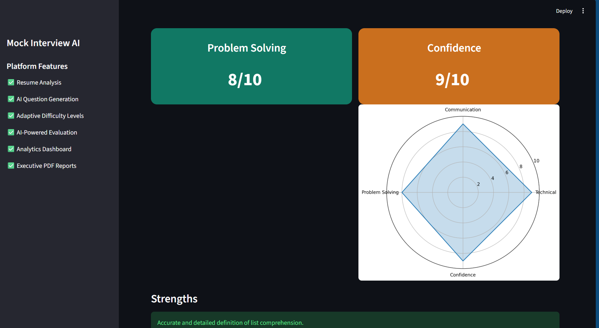
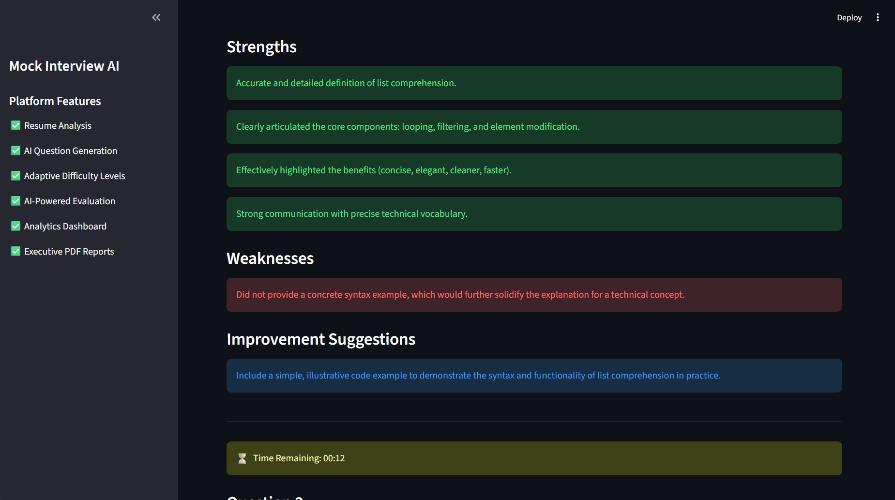
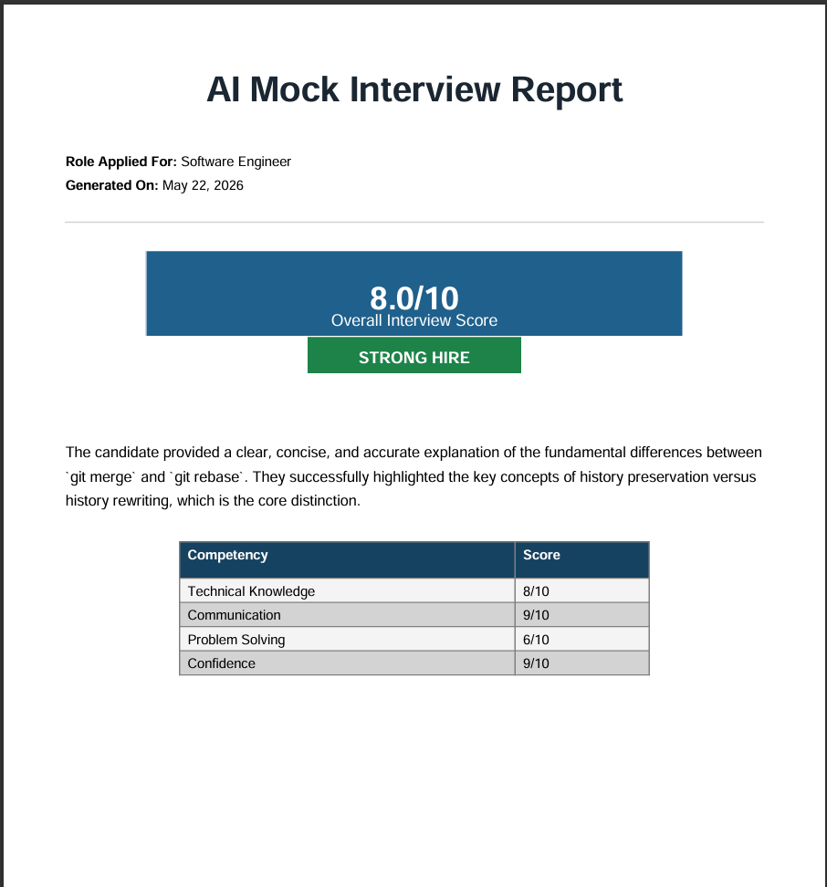
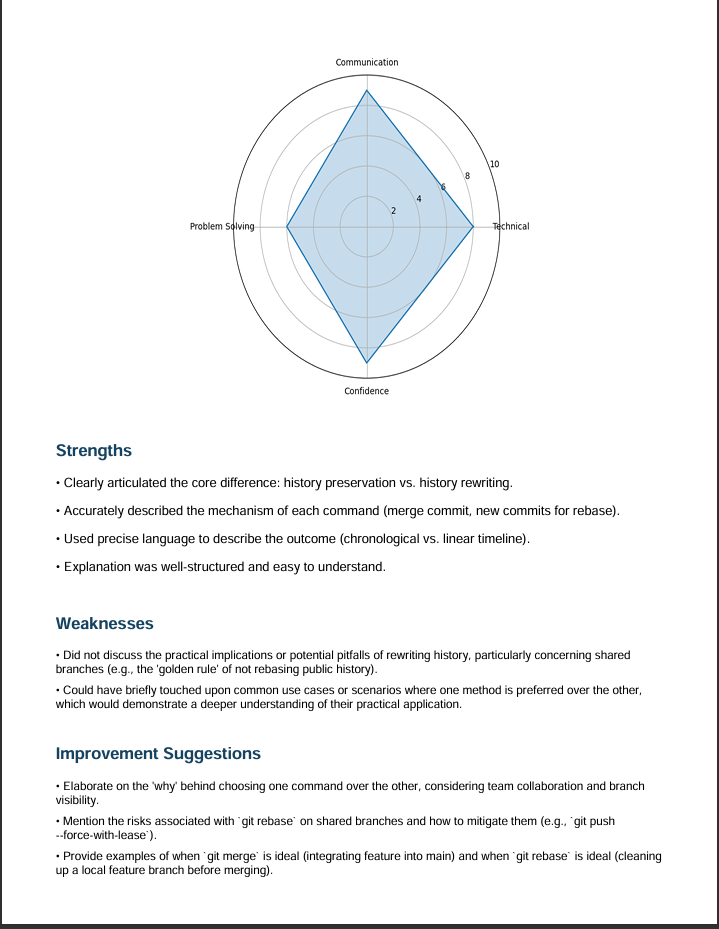

# Mock Interview AI

AI-powered mock interview preparation platform built using Python and Streamlit.

## Live Demo

https://mock-interview-ai-mjmd48veraxfue7bh4qivx.streamlit.app/

---

## Features

- Resume PDF Upload
- Resume Text Extraction
- AI-style Interview Question Generation
- Interactive Answer Evaluation
- Performance Dashboard
- Downloadable Interview Report PDF
- Role-Based Interview Practice

---

## Tech Stack

## Tech Stack

- **Google Gemini 1.5 Flash** — AI-powered question generation and evaluation
- **Python** — Backend logic and API integration
- **Streamlit** — Interactive web interface
- **PyMuPDF** — Resume PDF parsing
- **ReportLab** — Automated PDF report generation
- **Matplotlib** — Performance radar charts
---

## Project Architecture

```text
mock-interview-ai/
│
├── app/
│   └── services/
│       ├── llm_service.py
│       ├── feedback_service.py
│       ├── report_service.py
│       └── resume_service.py
│
├── assets/
│
├── main.py
├── requirements.txt
└── README.md
```
# Mock Interview AI

## Screenshots

### Homepage



### Dashboard



### Questions



### Evaluation





### PDF Report1







---

## Local Setup

```bash
git clone https://github.com/Shreyanshi-07/mock-interview-ai.git

cd mock-interview-ai

pip install -r requirements.txt

streamlit run main.py
```

---

## Current Features

- **Real-time AI evaluation** powered by Google Gemini API  
- Resume-based question generation tailored to your experience  
- Multi-dimensional scoring (Technical, Communication, Problem-solving, Confidence)  
- Interactive performance dashboard with radar charts  
- Downloadable PDF interview reports  
- Role-specific interview modes (SWE, Frontend, Backend, Data, ML)  

## Future Improvements

- User authentication and session management
- Interview history tracking with trend analysis
- Voice input/output using Whisper + TTS
- Real-time streaming AI responses
- Advanced analytics dashboard
- Docker containerization