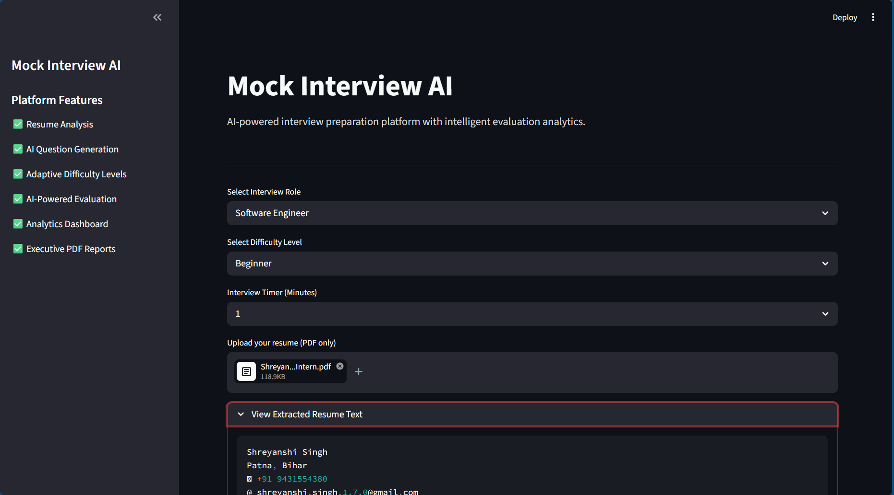

# Mock Interview AI

AI-powered mock interview preparation platform built using Python and Streamlit.

## Live Demo

https://mock-interview-ai-mjmd48veraxfue7bh4qivx.streamlit.app/

---

## Features

- Resume PDF Upload
- Resume Text Extraction
- AI-style Interview Question Generation
- Interactive Answer Evaluation
- Performance Dashboard
- Downloadable Interview Report PDF
- Role-Based Interview Practice

---

## Tech Stack

- Python
- Streamlit
- ReportLab
- PyMuPDF
- Git & GitHub

---

## Project Architecture

```text
mock-interview-ai/
│
├── app/
│   └── services/
│       ├── llm_service.py
│       ├── feedback_service.py
│       ├── report_service.py
│       └── resume_service.py
│
├── assets/
│
├── main.py
├── requirements.txt
└── README.md
```
# Mock Interview AI

## Screenshots

### Homepage


### Dashboard



### Questions


### Evaluation


### PDF Report1


---

## Local Setup

```bash
git clone https://github.com/Shreyanshi-07/mock-interview-ai.git

cd mock-interview-ai

pip install -r requirements.txt

streamlit run main.py
```

---

## Future Improvements
- Advanced AI scoring system
- Interview history tracking
- Authentication system
- Dark mode UI